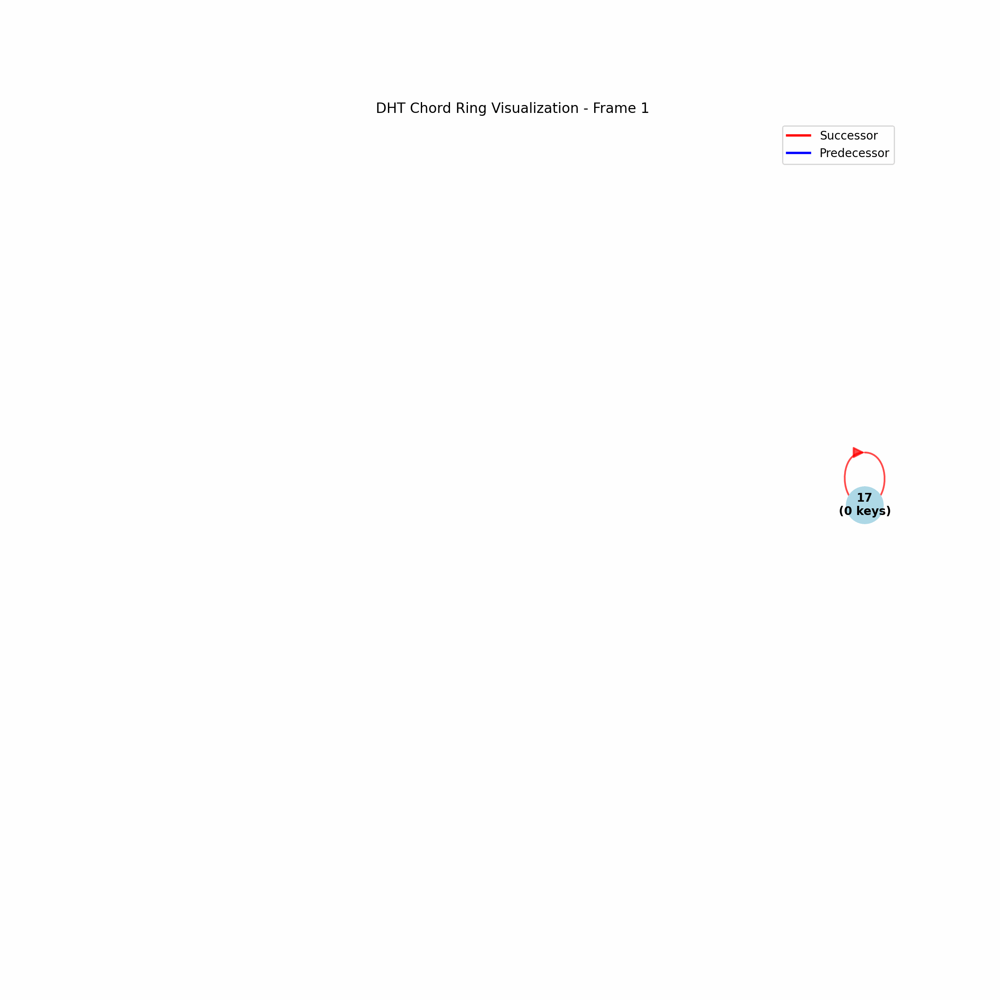
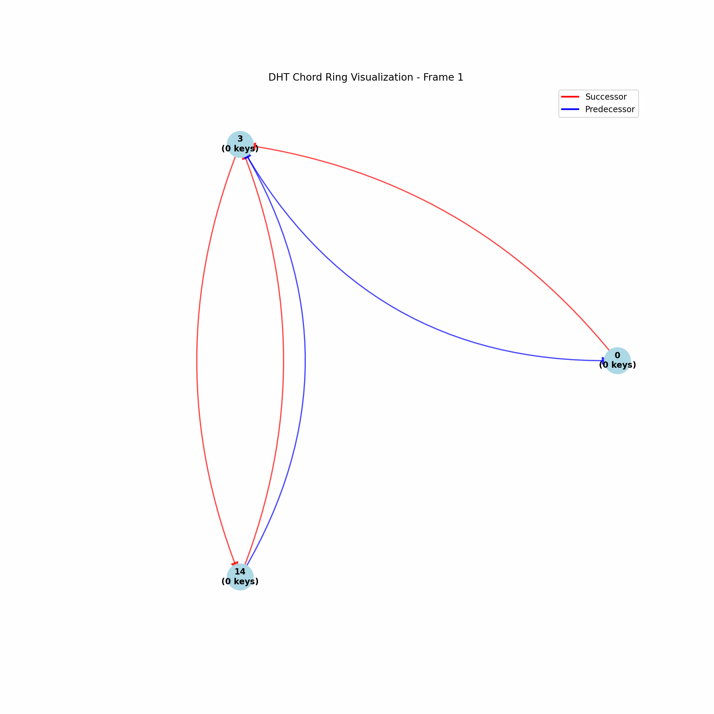

# Chord DHT Implementation

This project implements a Chord Distributed Hash Table (DHT) in Go. It simulates various scenarios to demonstrate the functionality and robustness of the Chord protocol.

## Features

- Simple Chord network creation and key-value storage
- Stress testing with multiple nodes and a large number of keys
- Network growth simulation
- Node leave scenario and data integrity check

## Visual Demonstrations

### Simple Chord Network



This GIF demonstrates a simple Chord network in action, showing how nodes are organized and how key-value pairs are distributed.

### Chord Network with Finger Tables


This visualization shows the finger tables of nodes in a Chord network, illustrating how efficient routing is achieved.

### Stress Testing with Many Keys


This GIF showcases the network's behavior when handling a large number of keys, demonstrating its scalability.

### Node Leave Scenario



This animation illustrates what happens when a node leaves the network, showing how the Chord protocol maintains data integrity.

## Prerequisites

- Go 1.15 or higher

## Installation

1. Clone the repository:
   ```
   git clone https://github.com/ozeliurs/PolyChord.git
   ```
2. Navigate to the project directory:
   ```
   cd PolyChord
   ```

## Usage

The program supports four different scenarios. To run a scenario, use the following command:

```
go run . simple|stress_keys|network_growth|node_leave
```

### Scenarios

1. **Simple Scenario** (`simple`):
   Creates a small network with three nodes and demonstrates basic key-value insertion and retrieval.

   ```
   go run . simple
   ```

2. **Stress Keys Scenario** (`stress_keys`):
   Creates a network with 10 nodes and inserts 1000 key-value pairs to test performance under load.

   ```
   go run . stress_keys
   ```

3. **Network Growth Scenario** (`network_growth`):
   Simulates network growth by starting with 3 nodes, inserting some initial keys, and then rapidly adding 25 more nodes. It checks key retrieval before, during, and after network growth.

   ```
   go run . network_growth
   ```

4. **Node Leave Scenario** (`node_leave`):
   Creates a network with three nodes, inserts random key-value pairs, and then simulates one node leaving the network. It checks data integrity before and after the node leaves.

   ```
   go run . node_leave
   ```

## Visualization

The project includes a Python script (`chord/viz.py`) for visualizing the Chord DHT network. This script creates an animated GIF that illustrates the network structure, including nodes, their connections, and optionally, finger tables. It uses NetworkX and Matplotlib to generate a circular layout of the Chord ring, with nodes represented as circles and connections as colored arrows.

To run the visualization, ensure you have NetworkX and Matplotlib installed, then execute `python chord/viz.py`. Use the `--show-fingers` flag to include finger table connections. The script reads the `data.json` file generated by the Go implementation and produces a `chord_ring_visualization.gif` file, providing a dynamic view of the network's evolution over time.

## Output

Each scenario will print relevant information to the console, including:

- Network structure
- Key-value operations
- Timing information (for stress testing)
- Data integrity checks

At the end of each scenario, a JSON representation of the network state is printed.

## Contributing

Contributions are welcome! Please feel free to submit a Pull Request.

## License

This project is licensed under the MIT License.
